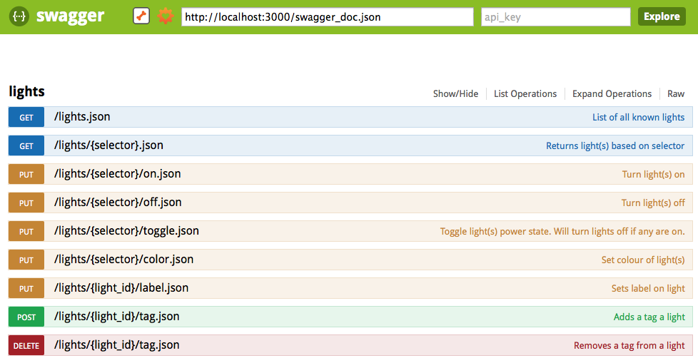

# LIFX HTTP API

This is an **unofficial** JSON RESTful API service for controlling LIFX devices. This API does not include any additional reliability checks that does not already exist in the [LIFX gem](https://github.com/LIFX/lifx-gem).

## Requirements

* Ruby 2.1.1
* Bundler

## Usage

* Clone the repo: `git clone https://github.com/chendo/lifx-rest.git`
* Change directory: `cd lifx-rest`
* Bundle: `bundle`
* Run: `./start.sh`
* Test if working: `curl http://localhost:3000/lights.json`

`start.sh` will serve the API up on `0.0.0.0:3000`.

## API

* `selector` is either:
  * `all` for all lights
  * `label:[label]` for light with label `label`
  * `tag:[tag]` for lights with tag `tag`
  * `[light_id]` for light with id `light_id`
* `GET /lights` - Lists all lights
* `GET /lights/{selector}` - Lists lights matching `selector`
* `PUT /lights/{selector}/on` - Turns lights matching `selector` on
* `PUT /lights/{selector}/off` - Turns lights matching `selector` off
* `PUT /lights/{selector}/toggle` - Toggle lights matching `selector`. If any lights in `selector` is on, it will turn them off
* `PUT /lights/{selector}/color` - Sets the color for lights matching `selector`. Color data can be passed as URL parameters or form parameters (JSON)
* `PUT /lights/{light_id}/label` - Changes the label of light with id `light_id`
* `POST /lights/{light_id}/tag` - Adds a tag to the light
* `DELETE /lights/{light_id}/tag` - Removes a tag from the light

## Documentation

This API is documented using [Swagger](https://github.com/wordnik/swagger-ui).
To view documentation and play with the API, start the API server locally, then visit http://swagger.wordnik.com and put `http://localhost:3000/swagger_doc.json` in the first text box, then hit `Explore`.

You should see something like this:

## License

MIT. See [LICENSE](LICENSE)
